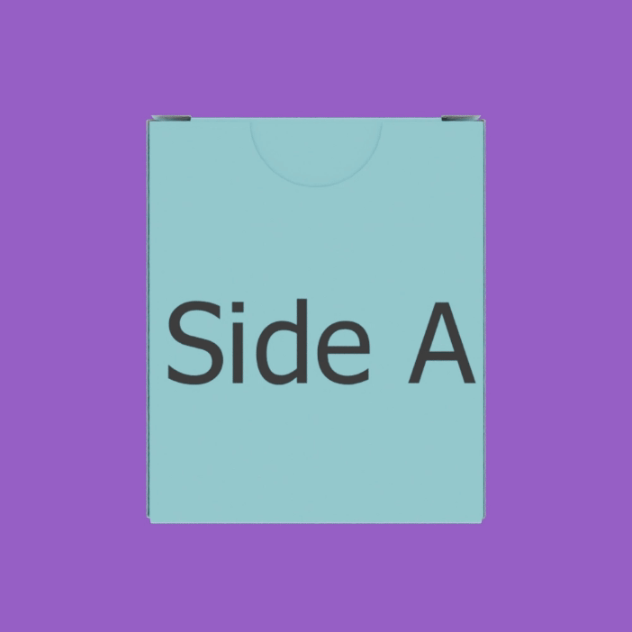
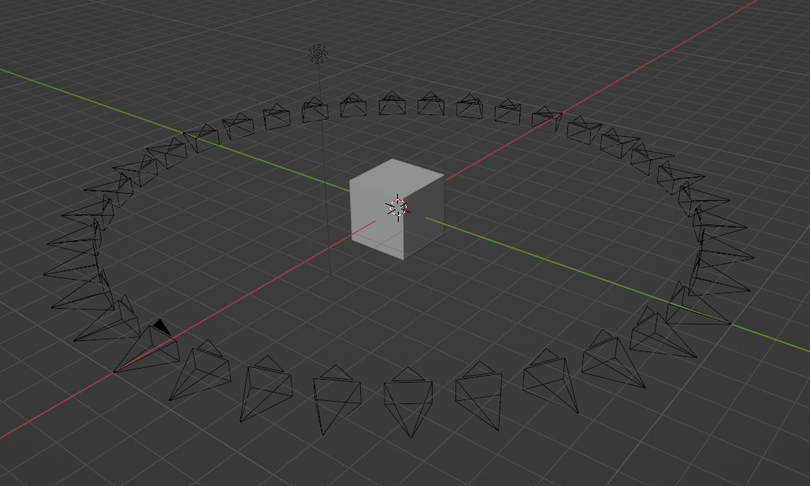
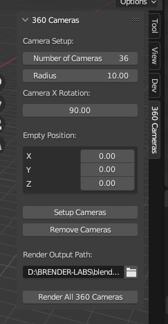

# 360 Camera Add-on for Blender

> This set of images has pink backgrounds, but they were rendered with transparent backgrounds.

## Description

The **360_CAMERA_ADDON** is a Blender add-on that simplifies the process of setting up and rendering a 360-degree view around an object. This add-on generates a specified number of cameras positioned around an empty object, allowing for the creation of multiple renders at different angles. It is particularly useful for generating spin 360 animations.

## Features

| 3D View                   | Add-on Tab               |
| ------------------------- | ------------------------ |
|  |  |

- **Camera Setup:** Easily configure the number of cameras and their radius around the empty object.
- **Empty Position:** Set the position of the empty object to control the center of rotation.
- **Camera X Rotation:** Adjust the X rotation of all cameras simultaneously.
- **Render Output Path:** Specify the output path for saving the renders.
- **Setup Cameras:** Quickly set up cameras based on the configured parameters.
- **Remove Cameras:** Remove all cameras with names starting with "360_" from the scene.
- **Render All 360 Cameras:** Render images for all cameras, creating a complete 360-degree view.

## Installation

1. Download the add-on script.
2. Open Blender and go to Edit > Preferences > Add-ons.
3. Click "Install" and select the downloaded script.
4. Enable the add-on by checking the checkbox next to "360_CAMERA_ADDON."

## Usage

1. Go to the 3D Viewport.
2. Find the **360 Cameras** tab in the N-panel.
3. Adjust the settings for the number of cameras, radius, empty position, and camera rotation.
4. Click **Setup Cameras** to generate the cameras based on the specified configuration.
5. Configure the render output path.
6. Click **Render All 360 Cameras** to generate renders for each camera.

## Notes

- Cameras are named in the format "360_camera_00, 360_camera_01, ..." for easy identification.
- Use **Remove Cameras** to clean up existing cameras before setting up new ones.

Enjoy creating stunning 360-degree renders with ease using the **360_CAMERA_ADDON**!